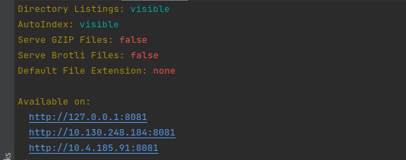

# spring

1. For run this application on your computer should be installed Maven,mySql database and JVM;
2. In database should be created table with name: mvc;
3. Move to the file application.properties: located by path: src/main/resources/application.properties
and set up the name and password from user in your db;
4. Install Apache maven on your pc if it was installed before move to the next step
5. Open terminal in project folder on you pc and run command: mvn spring-boot:run
6. For run front-end part in you're pc should be installed nodeJs and npm module
7. In project folder open terminal and execute the command: npm install http-server
8. For run local http server execute command in terminal: http-server 
9. Open one from available link: 

10. When link was opened you should move to the next path: 'src/main/webapp/WEB-INF/views/rest' 
11. For success running integration test's should be created schema in database with name: mvc_test
12. For get coverage information open console amd execute mvn test, after that you can find report in next directory: target/site/jacoco/index.html
